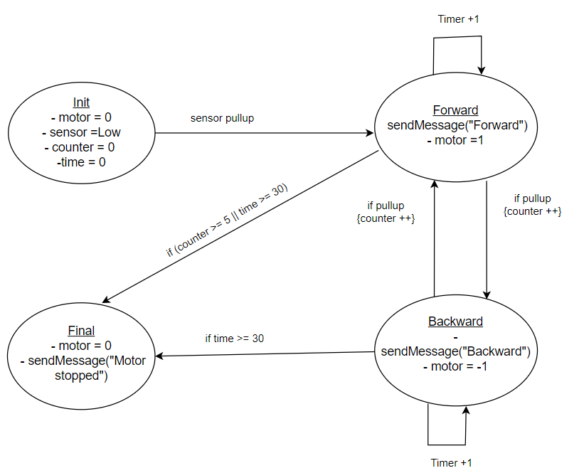

# Robotics Project - Software Homework

Welcome to the GitHub repository for the **Robotics Software Homework**! This project is part of a robotics class, designed to help you practice coding standards, version control with Git, and collaboration through peer reviews. The goal is to create a system that interfaces with a motor and an obstacle sensor, performing actions based on sensor input while adhering to best practices in code structure and versioning.

## FSM Diagram




## Project Structure

To keep things modular and maintainable, the project follows a well-organized structure, with all the source code located in the `/src` folder:

```
/robotics-project
│
├── /src                     # Source code files for the project
│   ├── main.ino             # Main Arduino file (entry point for the project)
│   ├── /fsm                 # Folder containing FSM logic
│   │   ├── FSM.h            # Header file defining FSM states and transitions
│   │   └── FSM.cpp          # Source file with FSM logic implementation
│   │
│   ├── /motor               # Folder containing motor control code
│   │   ├── MotorControl.h   # Header file for motor control functions
│   │   └── MotorControl.cpp # Source file implementing motor control functions
│   │
│   ├── /sensor              # Folder containing obstacle sensor code
│   │   ├── Sensor.h         # Header file for sensor functions
│   │   └── Sensor.cpp       # Source file for sensor detection logic
│   │
│   ├── /bluetooth           # Folder containing Bluetooth communication code
│   │   ├── Bluetooth.h      # Header file for Bluetooth functions
│   │   └── Bluetooth.cpp    # Source file for Bluetooth communication functions
│   │
│   └── config.h             # Configuration settings (pin assignments, timeouts, etc.)
│
└── README.md                # This file
```

### Explanation of the Structure:

#### 1. **`/src` (Source Code)**  
This folder contains all the source code for your project, divided into logical components:

- **`main.ino`**: This is the main Arduino file. It initializes the system, reads inputs, and triggers actions based on sensor data. It also integrates the logic from different modules (FSM, motor control, sensor, Bluetooth).
  
- **`/fsm`**: Contains files related to the **Finite State Machine (FSM)**:
  - **`FSM.h`**: Header file defining FSM states, transitions, and functions.
  - **`FSM.cpp`**: The implementation file for FSM logic, where you define the states and transitions based on sensor input.
  
- **`/motor`**: Contains files for **motor control**:
  - **`MotorControl.h`**: Header file for motor control functions.
  - **`MotorControl.cpp`**: Implements the motor control logic (e.g., motor direction changes, stop logic, etc.).
  
- **`/sensor`**: Contains logic for the **obstacle sensor**:
  - **`Sensor.h`**: Header file defining functions to interact with the sensor.
  - **`Sensor.cpp`**: Implements the sensor detection logic (e.g., detecting objects or hands).
  
- **`/bluetooth`**: Handles **Bluetooth communication**:
  - **`Bluetooth.h`**: Header file declaring Bluetooth communication functions.
  - **`Bluetooth.cpp`**: The implementation of Bluetooth communication (sending direction messages).
  
- **`config.h`**: A configuration file for hardware-specific settings like **pin assignments**, **timeouts**, etc.

---

## Project Description:

The goal of this project is to create a system that works as follows:

- **Initial State**: When the system starts, the motor is idle, and there is no object detected by the sensor.
- **First Object Detection**: The system rotates the motor in one direction when the sensor detects an object (like a hand moving).
- **Second Object Detection**: The system changes the motor's rotation direction when another object is detected.
- **Rotation Limits**: The motor will stop after changing direction 5 times or after running for 30 seconds. The system can only be reactivated by a reboot.
- **Bluetooth Communication**: Each time the sensor detects an object, a Bluetooth message is sent with the new direction of the motor's rotation. This message can be read on a smartphone.
- **Finite State Machine (FSM)**: The system logic is modeled using an FSM to handle the different states and transitions.

### Development Process:

This project will be developed collaboratively, with **4 branches** each contributed by a different student. Each branch will represent a different part of the system, and pull requests (PRs) will be created for peer review and merging.

### Grading Criteria:

Your grade will be based on the following factors:
- **FSM Implementation (30%)**: Correct implementation of the Finite State Machine.
- **Git Specifications (30%)**: Proper use of Git, versioning, and pull requests.
- **Coding Good Practices (30%)**: Clean, maintainable, and well-documented code.
- **Bluetooth Connection (10%)**: Proper Bluetooth communication implementation.

### Key Advice:
- **Interrupts**: Use interrupts to efficiently handle sensor detections.
- **Code Structure**: Plan the structure of your code and files before you begin, considering how branches will interact and potential conflicts.
- **Branch Interdependencies**: Be mindful of how different branches will merge and how their changes may affect the overall system.

### Deadline: 
All work must be completed and submitted by **9/12/2024**.
